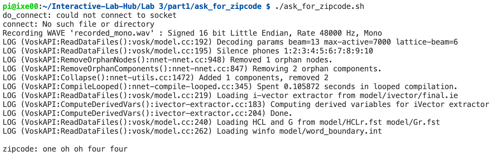
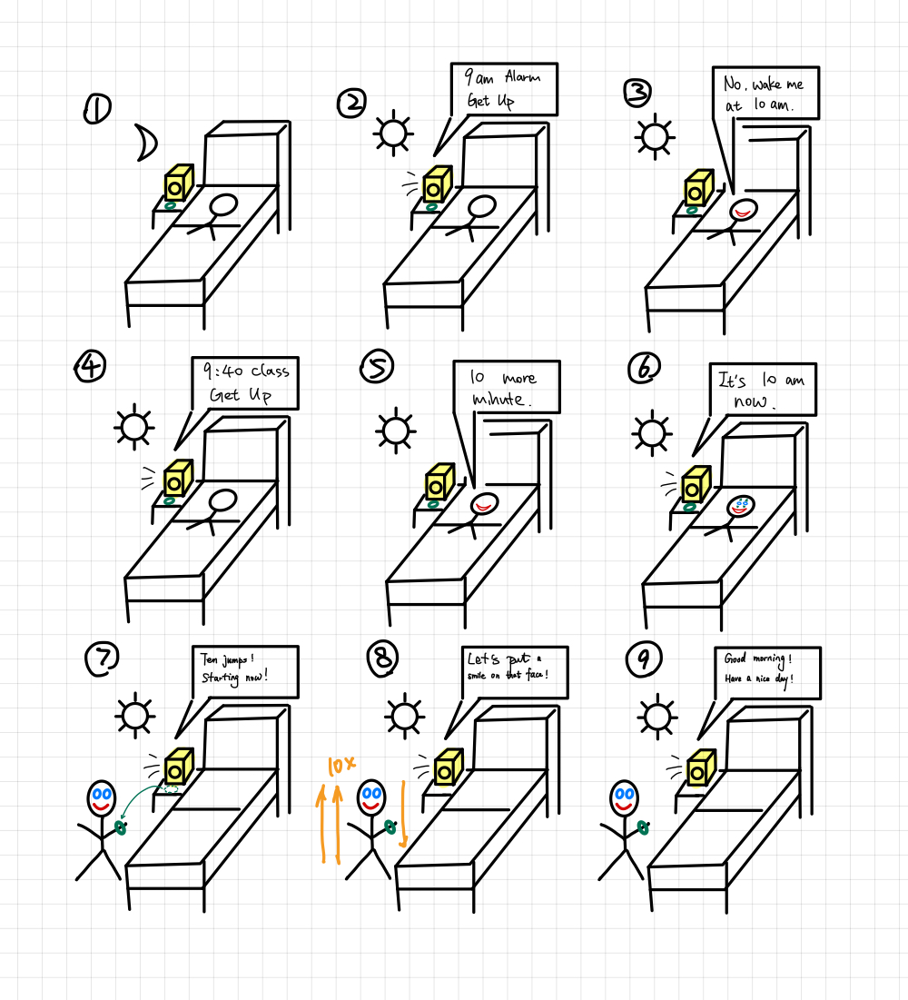

# Chatterboxes
[](https://www.youtube.com/embed/Q8FWzLMobx0?start=19)

In this lab, we want you to design interaction with a speech-enabled device--something that listens and talks to you. This device can do anything *but* control lights (since we already did that in Lab 1).  First, we want you first to storyboard what you imagine the conversational interaction to be like. Then, you will use wizarding techniques to elicit examples of what people might say, ask, or respond.  We then want you to use the examples collected from at least two other people to inform the redesign of the device.

We will focus on **audio** as the main modality for interaction to start; these general techniques can be extended to **video**, **haptics** or other interactive mechanisms in the second part of the Lab.

## Prep for Part 1: Get the Latest Content and Pick up Additional Parts 

### Pick up Additional Parts

As mentioned during the class, we ordered additional mini microphone for Lab 3. Also, a new part that has finally arrived is encoder! Please remember to pick them up from the TA.

### Get the Latest Content

As always, pull updates from the class Interactive-Lab-Hub to both your Pi and your own GitHub repo. As we discussed in the class, there are 2 ways you can do so:

**\[recommended\]**Option 1: On the Pi, `cd` to your `Interactive-Lab-Hub`, pull the updates from upstream (class lab-hub) and push the updates back to your own GitHub repo. You will need the *personal access token* for this.

```
pi@ixe00:~$ cd Interactive-Lab-Hub
pi@ixe00:~/Interactive-Lab-Hub $ git pull upstream Fall2021
pi@ixe00:~/Interactive-Lab-Hub $ git add .
pi@ixe00:~/Interactive-Lab-Hub $ git commit -m "get lab3 updates"
pi@ixe00:~/Interactive-Lab-Hub $ git push
```

Option 2: On your your own GitHub repo, [create pull request](https://github.com/FAR-Lab/Developing-and-Designing-Interactive-Devices/blob/2021Fall/readings/Submitting%20Labs.md) to get updates from the class Interactive-Lab-Hub. After you have latest updates online, go on your Pi, `cd` to your `Interactive-Lab-Hub` and use `git pull` to get updates from your own GitHub repo.

## Part 1.
### Text to Speech 

In this part of lab, we are going to start peeking into the world of audio on your Pi! 

We will be using a USB microphone, and the speaker on your webcamera. (Originally we intended to use the microphone on the web camera, but it does not seem to work on Linux.) In the home directory of your Pi, there is a folder called `text2speech` containing several shell scripts. `cd` to the folder and list out all the files by `ls`:

```
pi@ixe00:~/text2speech $ ls
Download        festival_demo.sh  GoogleTTS_demo.sh  pico2text_demo.sh
espeak_demo.sh  flite_demo.sh     lookdave.wav
```

You can run these shell files by typing `./filename`, for example, typing `./espeak_demo.sh` and see what happens. Take some time to look at each script and see how it works. You can see a script by typing `cat filename`. For instance:

```
pi@ixe00:~/text2speech $ cat festival_demo.sh 
#from: https://elinux.org/RPi_Text_to_Speech_(Speech_Synthesis)#Festival_Text_to_Speech

echo "Just what do you think you're doing, Dave?" | festival --tts
```

Now, you might wonder what exactly is a `.sh` file? Typically, a `.sh` file is a shell script which you can execute in a terminal. The example files we offer here are for you to figure out the ways to play with audio on your Pi!

You can also play audio files directly with `aplay filename`. Try typing `aplay lookdave.wav`.

\*\***Write your own shell file to use your favorite of these TTS engines to have your Pi greet you by name.**\*\*
(This shell file should be saved to your own repo for this lab.)

[t2s_name.sh](./part1/t2s_name.sh)

Bonus: If this topic is very exciting to you, you can try out this new TTS system we recently learned about: https://github.com/rhasspy/larynx

### Speech to Text

Now examine the `speech2text` folder. We are using a speech recognition engine, [Vosk](https://alphacephei.com/vosk/), which is made by researchers at Carnegie Mellon University. Vosk is amazing because it is an offline speech recognition engine; that is, all the processing for the speech recognition is happening onboard the Raspberry Pi. 

In particular, look at `test_words.py` and make sure you understand how the vocab is defined. Then try `./vosk_demo_mic.sh`

One thing you might need to pay attention to is the audio input setting of Pi. Since you are plugging the USB cable of your webcam to your Pi at the same time to act as speaker, the default input might be set to the webcam microphone, which will not be working for recording.

\*\***Write your own shell file that verbally asks for a numerical based input (such as a phone number, zipcode, number of pets, etc) and records the answer the respondent provides.**\*\*

[ask_for_zipcode](./part1/ask_for_zipcode)

[ask_for_zipcode.sh](./part1/ask_for_zipcode/ask_for_zipcode.sh)

demo:



Bonus Activity:

If you are really excited about Speech to Text, you can try out [Mozilla DeepSpeech](https://github.com/mozilla/DeepSpeech) and [voice2json](http://voice2json.org/install.html)
There is an included [dspeech](./dspeech) demo  on the Pi. If you're interested in trying it out, we suggest you create a seperarate virutal environment for it . Create a new Python virtual environment by typing the following commands.

```
pi@ixe00:~ $ virtualenv dspeechexercise
pi@ixe00:~ $ source dspeechexercise/bin/activate
(dspeechexercise) pi@ixe00:~ $ 
```

### Serving Pages

In Lab 1, we served a webpage with flask. In this lab, you may find it useful to serve a webpage for the controller on a remote device. Here is a simple example of a webserver.

```
pi@ixe00:~/Interactive-Lab-Hub/Lab 3 $ python server.py
 * Serving Flask app "server" (lazy loading)
 * Environment: production
   WARNING: This is a development server. Do not use it in a production deployment.
   Use a production WSGI server instead.
 * Debug mode: on
 * Running on http://0.0.0.0:5000/ (Press CTRL+C to quit)
 * Restarting with stat
 * Debugger is active!
 * Debugger PIN: 162-573-883
```
From a remote browser on the same network, check to make sure your webserver is working by going to `http://<YourPiIPAddress>:5000`. You should be able to see "Hello World" on the webpage.

### Storyboard

Storyboard and/or use a Verplank diagram to design a speech-enabled device. (Stuck? Make a device that talks for dogs. If that is too stupid, find an application that is better than that.) 

\*\***Post your storyboard and diagram here.**\*\*


Write out what you imagine the dialogue to be. Use cards, post-its, or whatever method helps you develop alternatives or group responses. 

| Situation | Device Response |
| --- | --- |
| current_time == alarm_time | "It is {current_time} now, get up!" |
| user.response == UserStatus.sleep | "What doesn’t kill you, simply makes you stranger!" * |
| user.response == UserStatus.getup | "Let’s put a smile on that face!" * |
| user.response == UserStatus.delay("10min") and user.plan is None | "Okay, next alarm at {time}." | 
| user.response == UserStatus.delay("10min") and user.plan is not None | "You have plan at {plan[0].time}, get up!" | 

\*\***Please describe and document your process.**\*\*

The device is basically a clock with voice interaction enabled. The clock starts speech interaction when the alarm time is reached. The clock continues to ‘talk to’ the user until there is a response from the user. 

* if the user get up (may be signaled by button pressed), reply "Let’s put a smile on that face!" and end interaction. 
* if the user says something like "10 more minute", the clock checks the user's calender 
   * if there is no plan around the alarm time, replay "Okay, next alarm in 10 minute", and update the alarm time to the new time. 
   * if there is plan around the alrm time, replay "You have a plan, get up", and repeat. 

### Acting out the dialogue

Find a partner, and *without sharing the script with your partner* try out the dialogue you've designed, where you (as the device designer) act as the device you are designing.  Please record this interaction (for example, using Zoom's record feature).

https://user-images.githubusercontent.com/61882479/135771571-ebfb7463-0acd-443e-b8eb-e7f913d66369.mov

https://user-images.githubusercontent.com/61882479/135771574-f4df033d-a1c7-4738-a5c8-7be1f8c1c513.mov

\*\***Describe if the dialogue seemed different than what you imagined when it was acted out, and how.**\*\*

The dialogue seemed quite similar to the design. But there are some undefined user behaviors (like ‘skip the class’ command in the second video). The ‘skip the …’ command can be added to the device. 

But there are so many commands and it is hard to cover every possible circumstance. There could be some default behaviors when unknown commands occur, like ‘I do not understand the command’. Or let the user know the possible commands in advance. 

### Wizarding with the Pi (optional)
In the [demo directory](./demo), you will find an example Wizard of Oz project. In that project, you can see how audio and sensor data is streamed from the Pi to a wizard controller that runs in the browser.  You may use this demo code as a template. By running the `app.py` script, you can see how audio and sensor data (Adafruit MPU-6050 6-DoF Accel and Gyro Sensor) is streamed from the Pi to a wizard controller that runs in the browser `http://<YouPiIPAddress>:5000`. You can control what the system says from the controller as well!

\*\***Describe if the dialogue seemed different than what you imagined, or when acted out, when it was wizarded, and how.**\*\*

# Lab 3 Part 2

For Part 2, you will redesign the interaction with the speech-enabled device using the data collected, as well as feedback from part 1.

## Prep for Part 2

1. What are concrete things that could use improvement in the design of your device? For example: wording, timing, anticipation of misunderstandings...
2. What are other modes of interaction _beyond speech_ that you might also use to clarify how to interact?
3. Make a new storyboard, diagram and/or script based on these reflections.

## Prototype your system

The system should:
* use the Raspberry Pi 
* use one or more sensors
* require participants to speak to it. 

*Document how the system works*

#### Updated storyboard


*Include videos or screencaptures of both the system and the controller.*

#### Video of the controller

https://user-images.githubusercontent.com/61882479/137019942-6bca57c0-8b0c-4666-b0db-676b643a6f33.mov

#### Video 1 of the interaction between the system and the user

https://user-images.githubusercontent.com/52665472/137035782-504e5919-95e4-46b5-9e0d-d27223868a69.mp4

#### Video 2 of the interaction between the system and the user

https://user-images.githubusercontent.com/52665472/137036138-cc3fee9f-025d-4458-b9af-9315efd0b6b6.mp4


## Test the system
Try to get at least two people to interact with your system. (Ideally, you would inform them that there is a wizard _after_ the interaction, but we recognize that can be hard.)

Answer the following:

### What worked well about the system and what didn't?

*What worked well:*\
*1. The system worked well as an interactive alarm. Essential functions, such as snoozing, stopping, and rescheduling the alarm, were properly implemented so that the users could directly speak to the alarm to achieve all these functionalities.*\
*2. The system could inform the users of upcoming events and send a notification right before the event.*\
*3. The responses from the alarm were not like those of traditional smart alarm clocks. Some users found the conversation between them and the system interesting.*

*What did not work well:*\
*1. One of our peers thought the sound of the alarm was not loud enough to wake him up.*\
*2. Because the system did not respond in a traditional way, some users thought the responses from the system were confusing.*\
*3. Users could cheat the system without actually jumping ten times to prove he/she get up by shaking the wristband.*

### What worked well about the controller and what didn't?

*What worked well:*\
*1. The controller could realize the basic interaction between the device and the person.*\
*2. The controller had the ability to set the alarm and check the current time.*\
*3. With the demo code and some modifications to the sound part, the controller could control the device to speak arbitrary sentences (but typing in the sentence takes time).*

*What did not work well:*\
*1. When the user’s response could not be answered through the scripted buttons, typing the response back to the user could take a while and it was error prone.*\
*2. The eavesdrop functionality from the demo code required the user to directly speak to the microphone (otherwise the response was not good), so we used other ways (to be in the same room) to get the user’s responses.*\
*3. The schedule part of the interaction was not implemented in the controller, i.e. we could not add the actual schedules/events into the controller.*

### What lessons can you take away from the WoZ interactions for designing a more autonomous version of the system?

*1. Make the existing features (response style, volume, and etc) more customizable could help the system satisfy the needs of a wider range of users.*\
*2. WoZ was a great way to prototype a system in that we could get real feedbacks from testing users and we did not need to spend too much time building a completed system. It saved us great amount of time, and we could adopt suggestions quickly.*\
*3. Users' behaviors were unpredictable. However sophisticated the system was, some users might still behave in a way that we did not anticipate. This, from another perspective, again proved the necessity of prototyping.*\
*4. We should not let the participants in the test know there was a wizard behind the scene, otherwise they would suspect the effectiveness of the system.*

### How could you use your system to create a dataset of interaction? What other sensing modalities would make sense to capture?

*1. Videos of users using our system could be used to capture their postures and gestures to study interaction between human and interactive systems.*\
*2. Conversations between the user and our system could be transcripted to observe how users reacted to an interactive system which did not respond as most current smart assistants.*\
*3. Motion sensors or web cams might be utilized to capture the users' action of sitting up in bed.*
